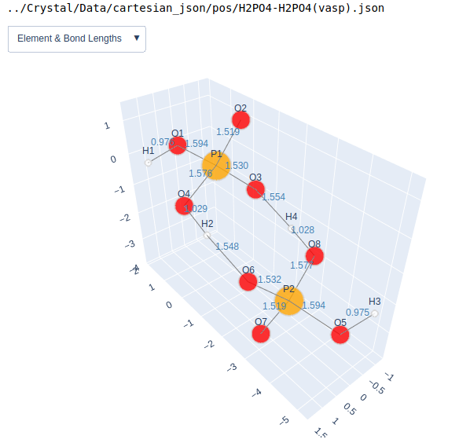

# CIF_Json_Parser

---

> This project is larged borrowed from [**xyz2graph**](https://github.com/zotko/xyz2graph). Thanks for their contribution.

Currently there is no direct CIF-graph conversion. This package is aimed to convert standard CIF crystal file converted into [NetworkX](https://networkx.github.io/) graph or [Plotly](https://plot.ly/) figure for 3D visualization.


# Requirements

---

- Python 3
- [NetworkX](https://networkx.github.io/)
- [Plotly](https://plot.ly/)

# CIF Format Specific

The CIF file should contained at least three `loop_`. Here is one example CIF file:

```
data_PO4
_audit_creation_date              2020-08-06
_audit_creation_method            'Materials Studio'
_symmetry_space_group_name_H-M    'P1'
_symmetry_Int_Tables_number       1
_symmetry_cell_setting            triclinic
loop_
_symmetry_equiv_pos_as_xyz
  x,y,z
_cell_length_a                    7.4300
_cell_length_b                    7.4300
_cell_length_c                    6.9700
_cell_angle_alpha                 90.0000
_cell_angle_beta                  90.0000
_cell_angle_gamma                 90.0000
loop_
_atom_site_label
_atom_site_type_symbol
_atom_site_fract_x
_atom_site_fract_y
_atom_site_fract_z
_atom_site_U_iso_or_equiv
_atom_site_adp_type
_atom_site_occupancy
O1     O     0.65866   0.59492   0.59947   0.00000  Uiso   1.00
O2     O     0.35285   0.40728   0.62805   0.00000  Uiso   1.00
O3     O     0.57612   0.35529   0.38450   0.00000  Uiso   1.00
O4     O     0.39267   0.66375   0.41634   0.00000  Uiso   1.00
P5     P     0.49402   0.50602   0.50703   0.00000  Uiso   1.00
loop_
_geom_bond_atom_site_label_1
_geom_bond_atom_site_label_2
_geom_bond_distance
_geom_bond_site_symmetry_2
_ccdc_geom_bond_type
O1     P5      1.532   .     S
O2     P5      1.533   .     S
O3     P5      1.535   .     S
O4     P5      1.530   .     S
```

At the beginning of this file, you can edit `cif_processing.py` file to get the information you want to add. Currently, the only useful information is `_audit_creation_date`.

The first `loop_` should contain the crystal cell information, all six items are useful in calculating the position.

The second `loop_` should at least contain `_atom_site_label`, `_atom_site_type_symbol`, `_atom_site_fract_x`, `_atom_site_fract_y`, `_atom_site_fract_z`. 

The third `loop_` contains bond information, these `_geom_bond_atom_site_label_1`, `_geom_bond_atom_site_label_2`, `_geom_bond_distance` three items must be avaialable.

The CIF file then be converted into two `json` Intermediate medium, which is `json` and `cartesian_json`, respectively. 

# Usage

First, in your `Data` folder, you should contain these subfolders:

- cif: original cif files
- json: for the output of intermediate json file
- cartesian_json: for the output of intermediate json which convert its coordinate into cartesian

Then, you can use `cif_processing.py` file to process all the cif file to intermedate json file, which is human-readable and python-friendly format.

Next, the example shows how to visualize the molecule. You can either use `to_networkx_graph` function in `graph_helper.py` to convert the CIF file into this common format.

## Normal Python

```
from cif_to_graph import CrystalGraph
from graph_helper import to_networkx_graph, to_plotly_figure
from plotly.offline import offline

# get the json file location, which can be converted by `cif_processing.py`
path = '../Crystal/Data/cartesian_json/pos/*.json'

# Draw all the files iteratively
for i in sorted(glob(path)):

    # Print the file name
    print(i)
    
    # Create the Crystal Graph object
    mg = CrystalGraph()
    
    # Read the json file 
    mg.read_json(i)

    # Create the Plotly figure object
    fig = to_plotly_figure(mg)

    # Plot the figure
    offline.plot(fig)

    # Convert the molecular graph to the NetworkX graph
    G = to_networkx_graph(mg)  

```

## Jupyter Notebook

```
from cif_to_graph import CrystalGraph
from graph_helper import to_networkx_graph, to_plotly_figure
from plotly.offline import init_notebook_mode, iplot
from glob import glob

# Initiate the Plotly notebook mode
init_notebook_mode(connected=True)

# get the json file location, which can be converted by `cif_processing.py`
path = '../Crystal/Data/cartesian_json/pos/*.json'

# Draw all the files iteratively
for i in sorted(glob(path)):

    # Print the file name
    print(i)

    # Create the Crystal Graph object
    mg = CrystalGraph()
    
    # Read the json file
    mg.read_json(i)
    
    # Create the Plotly figure object
    fig = to_plotly_figure(mg)
    
    # Plot the figure
    iplot(fig)

    # Convert the molecular graph to the NetworkX graph
    G = to_networkx_graph(mg)  
```

The result is shown below:



